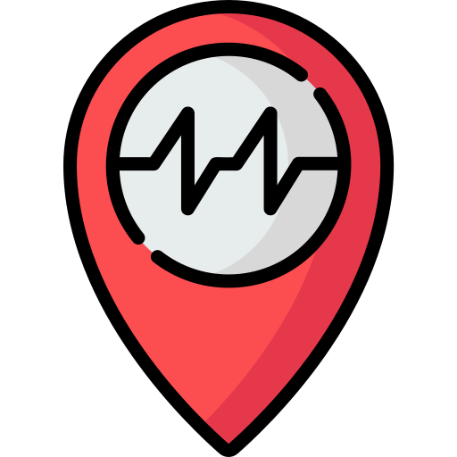

# Radar

## Overview

**Radar** is a mobile application designed and developed to provide real-time information on the latest earthquakes from reliable sources. The app offers various features to enhance user safety and awareness during seismic events.

### Features

- **Real-Time Earthquake Data**: Stay informed about the latest earthquakes with up-to-date data from trustworthy sources.

- **Google Maps Integration**: Visualize earthquake locations on Google Maps to understand their proximity to your current location or other areas of interest.

- **Smartwatch Health Data Integration**: Monitor user health during and after earthquakes, providing insights into potential injuries or health issues.

- **Voice Recording for Emergency**: Record and send voice messages as text to emergency services for immediate assistance during emergencies.

- **Emergency Contact Information**: Access emergency contact information and safety procedures for earthquakes.

- **Intuitive User Interface**: Designed with an intuitive and user-friendly interface for quick access to critical information during emergency situations.

- **Push Notifications**: Receive push notifications for significant earthquakes and timely updates on seismic activity using Firebase notifications.

## Screenshots

<table width="100%">
  <tbody>
    <tr>
       <td width="1%"></td>
      <td width="1%"></td>
      <td width="1%"></td>
    </tr>
    <tr>
      <td width="1%"></td>
       <td width="1%"></td>
      <td width="1%"></td>
    </tr>
  </tbody>
</table>
    <h1>Setup Guide</h1>
    <h2>Prerequisites</h2>
    
If you don't have Flutter SDK installed, please visit the <a href="https://flutter.dev/">official Flutter site</a>.

    <h2>Installation Steps</h2>
    <h3>1. Clone the Repository</h3>
    
Run the following command to fetch the latest source code from the master branch:

    <pre><code>git clone https://github.com/AmrSabbagh35/Radar.git</code></pre>
    <h3>2. Run the App</h3>
    
Use Android Studio, VS Code, or the command line to run the app:

    <ul>
        <li>Option 1: Run with Android Studio or VS Code</li>
        <li>Option 2: Run with the command line</li>
    </ul>
    <h4>Option 1: Run with Android Studio or VS Code</h4>
    
Open the project in your preferred IDE and follow the standard steps for running a Flutter app.

    <h4>Option 2: Run with the Command Line</h4>
    
Run the following commands in the terminal:

    <pre><code>flutter pub get</code></pre>
    <pre><code>flutter run --flavor github</code></pre>
    
Replace <code>--flavor github</code> with the appropriate flavor or configuration if needed.

    <h3>3. Verify Installation</h3>
    
Ensure that the app is running without errors and can be accessed through the specified flavor or configuration.

